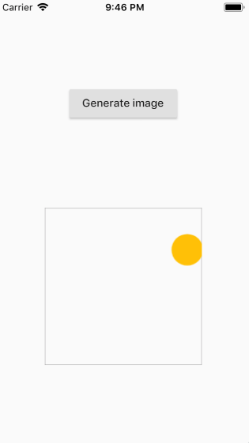

# canvas_to_image

a simple Flutter canvas to png file example



```dart
final recorder = new ui.PictureRecorder();
final canvas = new Canvas(
    recorder,
    new Rect.fromPoints(
        new Offset(0.0, 0.0), new Offset(200.0, 200.0)));

final stroke = new Paint()
  ..color = Colors.grey
  ..style = PaintingStyle.stroke;

canvas.drawRect(
    new Rect.fromLTWH(0.0, 0.0, 200.0, 200.0), stroke);

final paint = new Paint()
  ..color = color
  ..style = PaintingStyle.fill;

canvas.drawCircle(
    new Offset(
      widget.rd.nextDouble() * 200.0,
      widget.rd.nextDouble() * 200.0,
    ),
    20.0,
    paint);

final picture = recorder.endRecording();
final img = picture.toImage(200, 200);
final pngBytes = await img.toByteData(format: new ui.EncodingFormat.png());
```

In this example the image is displayed in a Image.memory widget

```dart
new Image.memory(new Uint8List.view(imgBytes.buffer));
```

___

## Getting Started with Flutter

For help getting started with Flutter, view our online
[documentation](https://flutter.io/).
